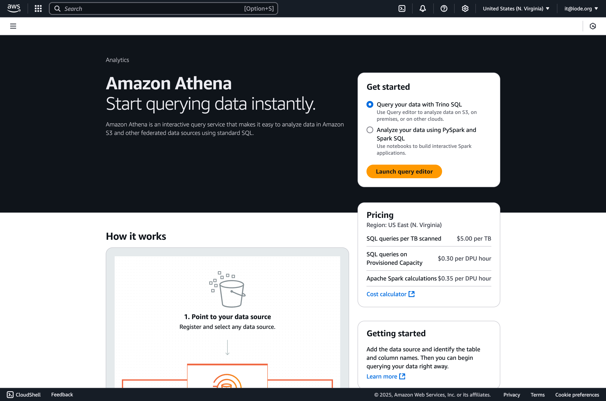
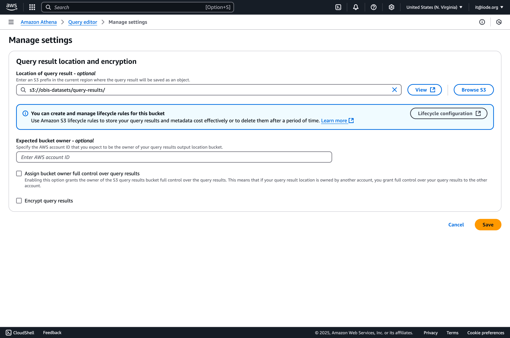
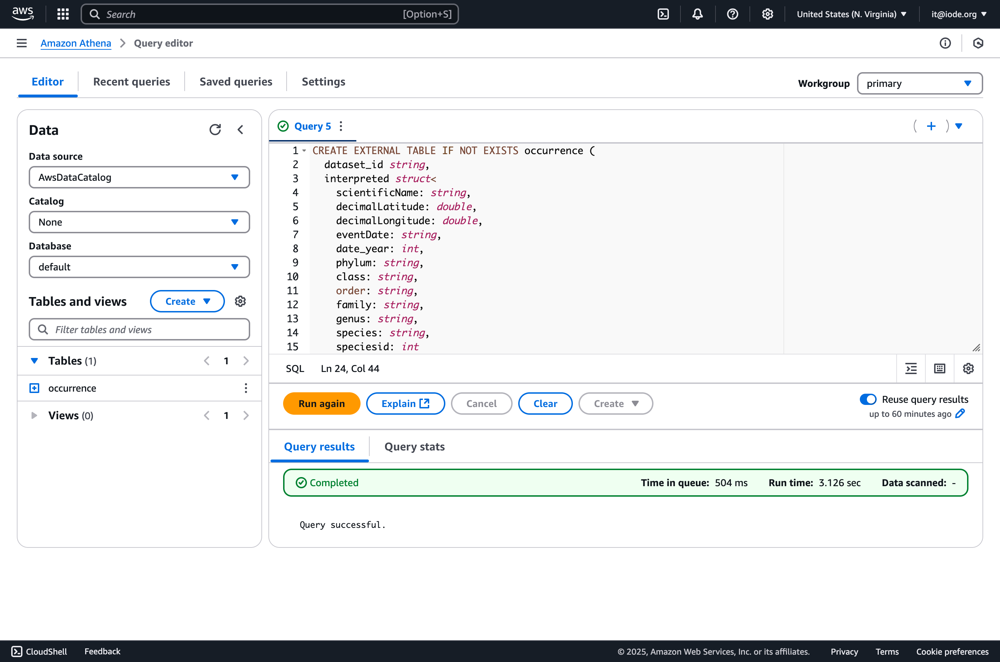
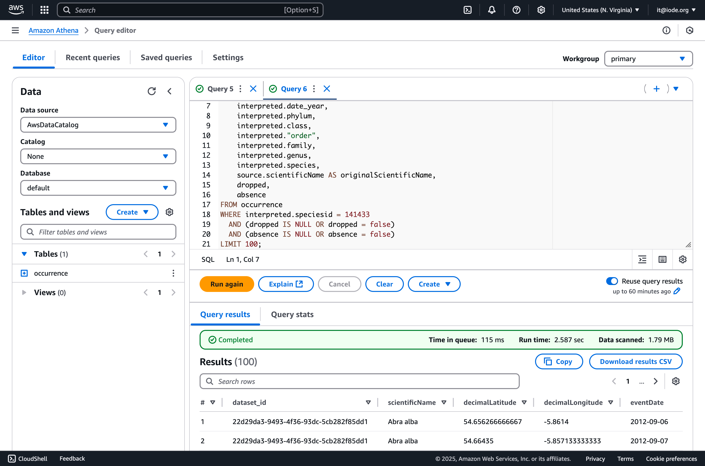
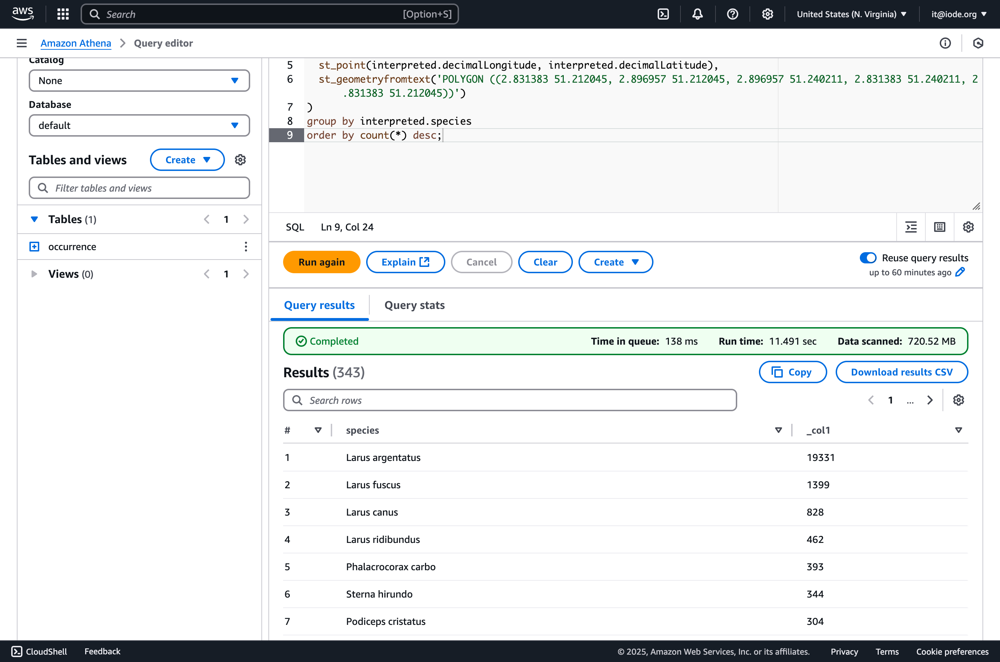

# OBIS Open Data on AWS

This is the documentation for the Ocean Biodiversity Information System (OBIS) Open Data available on AWS.

- [Data license and citation](#data-license)
- [Data organization](#data-organization)
- [Data access](#data-access)

## Data license and citation

The OBIS dataset is built from source datasets that are licensed with CC0, CC BY, or CC BY-NC licenses. License and citation information for every source dataset is available at `s3://obis-open-data/licenses.tsv`. The full OBIS dataset is licensed under CC BY-NC and can be cited as follows:

```
Ocean Biodiversity Information System (OBIS) (25 March 2025) OBIS Occurrence Data https://doi.org/10.25607/obis.occurrence.b89117cd.
```

## Data organization

The OBIS dataset is available as [GeoParquet](https://geoparquet.org/) from AWS S3 at `s3://obis-open-data/occurrence` with one file per source dataset. Browse the files [here](https://obis-open-data.s3.amazonaws.com/index.html). The source dataset Darwin Core Archives are available from `s3://obis-open-data/dwca`. The Darwin Core Archive format is documented [here](https://ipt.gbif.org/manual/en/ipt/latest/dwca-guide).

```
obis-open-data/
├─ licenses.tsv
├─ occurrence/
│  ├─ 00017595-e015-4ec6-bf8a-b013e0dca521.parquet
│  +─ ...
+─ dwca/
   ├─ 00017595-e015-4ec6-bf8a-b013e0dca521.zip
   +─ ...
```

The Parquet schema contains the following top level fields:

| Field | Description |
|---|---|
| _id | OBIS record UUID. |
| dataset_id | OBIS dataset UUID. |
| node_ids | OBIS node UUIDs. |
| source | Source Darwin Core fields. |
| interpreted | Interpreted Darwin Core fields (see below). |
| extensions | Darwin Core extension records. This currently includes records of types http://rs.iobis.org/obis/terms/ExtendedMeasurementOrFact and http://rs.gbif.org/terms/1.0/DNADerivedData |
| missing | Recommended fields with missing values. |
| invalid | Fields with invalid values. |
| flags | Quality flags. |
| dropped | Dropped flag. This indicates records with insufficient quality, for example due to missing coordinates or no match with the World Register of Marine Species (WoRMS). |
| absence | Absence flag. Note that by default the OBIS webservices do not expose absence records, but they are included in this dataset. |
| geometry | WKB geometry. |

The `interpreted` field contains the Darwin Core terms as submitted by the data provider, with the exception of the following fields which have been transformed or added by the OBIS quality control pipeline:

| Field | Description |
| --- | --- |
| decimalLongitude | Parsed and validated by OBIS. |
| decimalLatitude | Parsed and validated by OBIS. |
| date_start | Unix timestamp based on `eventDate` (start). |
| date_mid | Unix timestamp based on `eventDate` (middle). |
| date_end | Unix timestamp based on `eventDate` (end). |
| date_year | Year based on `eventDate`. |
| scientificName | Valid scientific name based on the `scientificNameID` or derived by matching the provided `scientificName` with WoRMS |
| minimumDepthInMeters | Parsed and validated by OBIS. |
| maximumDepthInMeters | Parsed and validated by OBIS. |
| coordinateUncertaintyInMeters | Parsed and validated by OBIS. |
| shoredistance | Distance from shore in meters added by OBIS quality control, based on OpenStreetMap. Negative value indicates that the observation was inland by -1 times that distance |
| bathymetry | Bathymetry added by OBIS. Bathymetry values based on EMODnet Bathymetry and GEBCO, see https://github.com/iobis/xylookup (Data references) |
| sst | Sea surface temperature added by OBIS. sst values based on Bio-Oracle, see https://github.com/iobis/xylookup (Data references) |
| sss | Sea surface salinity added by OBIS. sss values based on Bio-Oracle, see https://github.com/iobis/xylookup (Data references)|
| marine | Marine environment flag based on WoRMS. |
| brackish | Brackish environment flag based on WoRMS. |
| aphiaid | AphiaID for the valid name based on the `scientificNameID` or derived by matching the provided `scientificName` with WoRMS. |
| redlist_category | IUCN Red List category. |
| superdomain | Based on WoRMS. |
| domain | Based on WoRMS. |
| kingdom | Based on WoRMS. |
| subkingdom | Based on WoRMS. |
| infrakingdom | Based on WoRMS. |
| phylum | Based on WoRMS. |
| phylum (division) | Based on WoRMS. |
| subphylum (subdivision) | Based on WoRMS. |
| subphylum | Based on WoRMS. |
| infraphylum | Based on WoRMS. |
| parvphylum | Based on WoRMS. |
| gigaclass| Based on WoRMS. |
| megaclass | Based on WoRMS. |
| superclass | Based on WoRMS. |
| class | Based on WoRMS. |
| subclass | Based on WoRMS. |
| infraclass | Based on WoRMS. |
| subterclass | Based on WoRMS. |
| superorder | Based on WoRMS. |
| order | Based on WoRMS. |
| suborder | Based on WoRMS. |
| infraorder | Based on WoRMS. |
| parvorder | Based on WoRMS. |
| superfamily | Based on WoRMS. |
| family | Based on WoRMS. |
| subfamily | Based on WoRMS. |
| supertribe | Based on WoRMS. |
| tribe | Based on WoRMS. |
| subtribe | Based on WoRMS. |
| genus | Based on WoRMS. |
| subgenus | Based on WoRMS. |
| section | Based on WoRMS. |
| subsection | Based on WoRMS. |
| series | Based on WoRMS. |
| species | Based on WoRMS. |
| subspecies | Based on WoRMS. |
| natio | Based on WoRMS. |
| variety | Based on WoRMS. |
| subvariety | Based on WoRMS. |
| forma | Based on WoRMS. |
| subforma | Based on WoRMS. |

## Data access
### Downloading the dataset

Use the [AWS CLI](https://aws.amazon.com/cli/) to download the dataset locally. The size of the dataset is around 50 GB.

```
aws s3 sync --no-sign-request s3://obis-open-data/occurrence/ ./occurrence/
```

### Example: Querying the dataset using Amazon Athena

The Amazon Athena service can be used to query the dataset on S3 using SQL. From the AWWS Console, go to Athena and select `Query your data with Trino SQL`.



In the Query editor, go to Settings and enter an S3 location to store results.



Then go back to the Query editor and run the following query to create an external table:

```sql
CREATE EXTERNAL TABLE IF NOT EXISTS occurrence (
  dataset_id string,
  interpreted struct<
    scientificName: string,
    decimalLatitude: double,
    decimalLongitude: double,
    eventDate: string,
    date_year: int,
    phylum: string,
    class: string,
    order: string,
    family: string,
    genus: string,
    species: string,
    speciesid: int
  >,
  source struct<
    scientificName: string
  >,
  dropped boolean,
  absence boolean
)
STORED AS PARQUET
LOCATION 's3://obis-open-data/occurrence/';
```



After creating the external table we can query the occurrence dataset like this:

```sql
SELECT
    dataset_id,
    interpreted.scientificName,
    interpreted.decimalLatitude,
    interpreted.decimalLongitude,
    interpreted.eventDate,
    interpreted.date_year,
    interpreted.phylum,
    interpreted.class,
    interpreted."order",
    interpreted.family,
    interpreted.genus,
    interpreted.species,
    source.scientificName AS originalScientificName,
    dropped,
    absence
FROM occurrence
WHERE interpreted.speciesid = 141433
  AND (dropped IS NULL OR dropped = false)
  AND (absence IS NULL OR absence = false)
LIMIT 100;
```

The resulting records can be downloaded as CSV using the `Download results CSV` button.



Athena also supports spqtial queries. Here's an example of a query to create a species checklist for a polygon of interest:

```sql
select interpreted.species, count(*)
from occurrence
where interpreted.species is not null and
st_within(
  st_point(interpreted.decimalLongitude, interpreted.decimalLatitude),
  st_geometryfromtext('POLYGON ((2.831383 51.212045, 2.896957 51.212045, 2.896957 51.240211, 2.831383 51.240211, 2.831383 51.212045))')
)
group by interpreted.species
order by count(*) desc;
```



### Example: Querying the dataset locally using Python

This is an example [DuckDB](https://duckdb.org/) query for a single species against a local copy of the dataset. Absence records and records of insufficient quality are excluded.

```python
import duckdb

query = """
    select
        dataset_id, _id as id,
        interpreted.*,
        source.scientificName as originalScientificName,
        flags,
        dropped,
        absence
    from read_parquet('../occurrence/*.parquet')
    where interpreted.speciesid = 141433
    and dropped is not true and absence is not true;
"""

df = duckdb.query(query).to_df()
```

### Example: Querying the dataset locally using R

This is an example [DuckDB](https://duckdb.org/) query for a single genus against a local copy of the dataset.

```r
library(DBI)
library(duckdb)

con <- dbConnect(duckdb::duckdb())

df <- dbGetQuery(con, "
    select interpreted.* from read_parquet('../occurrence/*.parquet')
    where interpreted.genus == 'Abra'
    and dropped is not true and absence is not true;
")
```

Spatial queries are supported as well. Use [https://wktmap.com](https://wktmap.com) to create a WKT string for the polygon of interest.

```r
library(DBI)
library(duckdb)

con <- dbConnect(duckdb::duckdb())

df <- dbGetQuery(con, "
    install spatial;
    load spatial;
    select interpreted.* from read_parquet('../occurrence/*.parquet')
    where ST_Intersects(geometry, ST_GeomFromText('POLYGON ((2.831383 51.212045, 2.896957 51.212045, 2.896957 51.240211, 2.831383 51.240211, 2.831383 51.212045))'))
    and dropped is not true and absence is not true;
")
```
